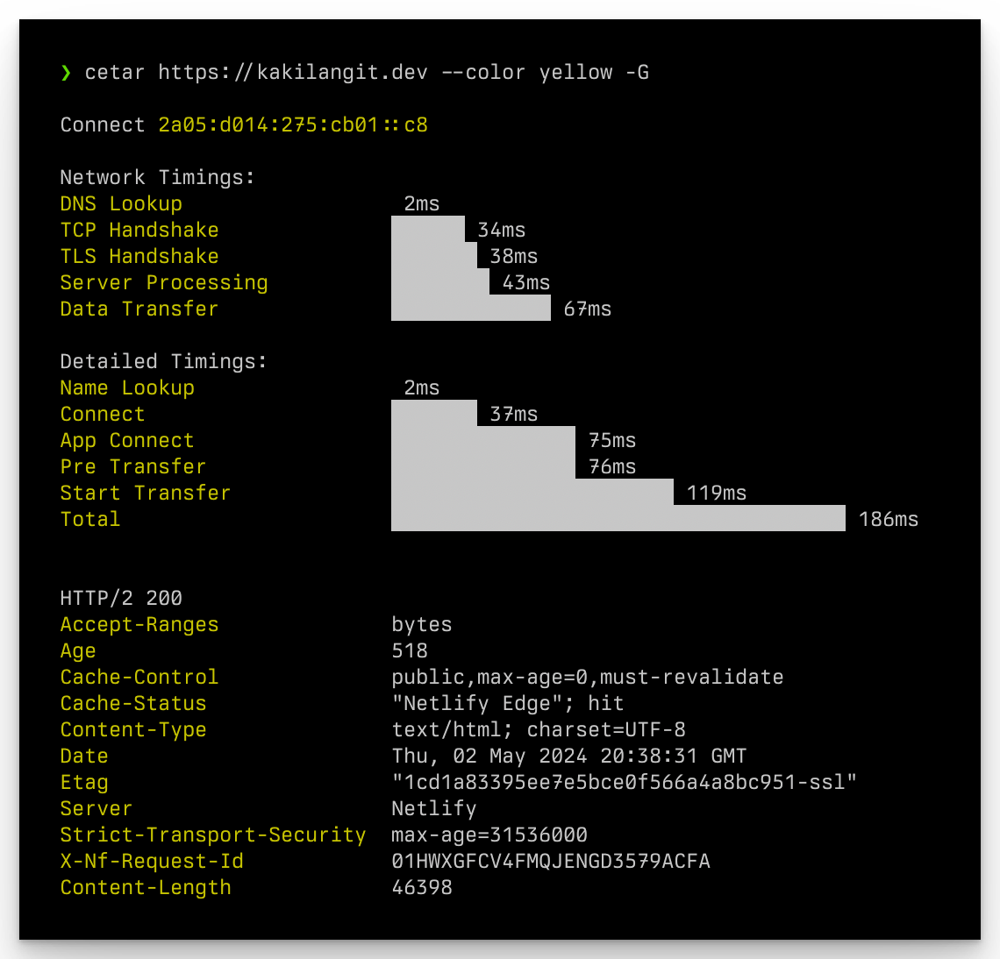

# Cetar

Cetar is CURL execution timing analyzer.

## Original Meaning

Cetar _/ce-tar/_ _n_ is the imitation of the sound of a whip being hit in Indonesian language.

## Installation

```shell
$ cargo install --path .
```

## Usage

```shell
💥 CURL execution timing analyzer

Usage: cetar [OPTIONS] <URL>

Arguments:
  <URL>

Options:
  -X, --method <METHOD>           Available methods: GET, HEAD, POST, PUT, DELETE, CONNECT, OPTIONS, TRACE, PATCH [default: GET]
  -H, --headers <HEADERS>         Pass custom header(s) to server, example: -H 'Accept: application/json'
  -d, --data <DATA>               HTTP request data to send, example: -d 'key=value' -d @file.json -d '{"key": "value"}'
  -o, --output <OUTPUT>           Write output to <file>
  -B, --display-response-body     Display response body
  -G, --display-response-headers  Display response headers
      --color <COLOR>             Main output color, available colors: black, red, green, yellow, blue, magenta, cyan, white [default: cyan]
  -h, --help                      Print help
  -V, --version                   Print version
```

## Screenshot



## License

MIT
Copyright (c) 2024 kakilangit
